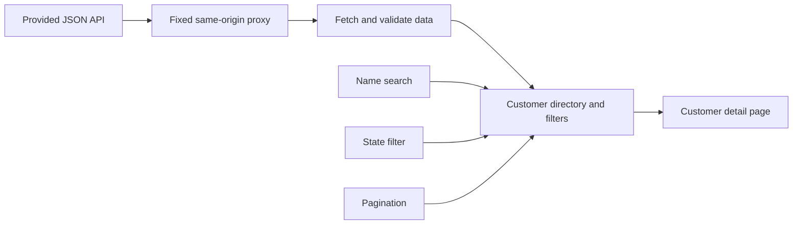

# Requirements audit — September 29, 2026

Source: [Juntos Somos Mais frontend challenge](https://github.com/juntossomosmais/frontend-challenge). The upstream brief, code, documentation, tests and production build in Edge were checked.

## Required functionality

| Requirement            | Result                                                           |
| ---------------------- | ---------------------------------------------------------------- |
| Customer cards         | Photo, name and address, linking to details                      |
| First/last-name search | Full or multiword queries, ignoring case and accents             |
| Brazilian state filter | One or multiple states, combined with search                     |
| Pagination             | Previous/next and page selection; additionally 9/33/99 items     |
| Customer detail page   | Email, phones, address, direct URL and return to filters         |
| Specified API          | Verified live through a fixed intermediary, allowed by the brief |
| Tests                  | 19 passing tests; the brief describes tests as welcome           |
| Setup instructions     | Included; Node requirements match installed tools                |

No blocking functional defect was found in the checked scenarios.

## Original flow diagram

The implementation preserves this flow:

The proxy addresses cross-origin restrictions without replacing the data source. Phone search, themes, language selection, page sizes and list display extend the directory without removing required behavior. A full workspace is a future idea, not an implemented feature.

## Documentation and delivery

- All required files exist: `ai-journey/README.md`, `prompts.md` and `learnings.md`.
- The participant reflection is recorded separately from assistant technical observations. Reports are in English; translated quotations are identified.
- Delivery requires a public GitHub repository and an Issue in the challenge repository. A hosted live demo is optional.
- The [actual Issue template](https://github.com/juntossomosmais/frontend-challenge/blob/master/.github/ISSUE_TEMPLATE/frontend-submission.yml) also requires full name, email, repository URL, framework, approach/UI/AI summaries, LinkedIn and GitHub profile, and checklist confirmations. The earlier audit checked the README but missed this template; this was corrected during submission preparation.
- Data loading requires a Node server or equivalent proxy. Uploading `dist` alone is insufficient.

## Verification

- `npm test`: 19/19 passed; production build and formatting check passed.
- Live API: 200 customers, search, combined filters, first/last pages, detail reload and preserved search on return.
- Controlled browser cases: upstream failure/retry, empty/malformed data, unknown customer/route, invalid page/page-size parameters.
- Both views and all three themes at 1440, 768, 390 and 320 px: no horizontal overflow observed.
- Keyboard theme controls, skip link, saved preferences and reduced motion checked.
- No JavaScript page errors observed.
- Corrected stale documentation and Node requirements. An older browser check needed an exact page-selector label after “Per page” was added; this was an ambiguous test locator, not a UI defect.

## Optional improvements

| Suggested item                    | Status                                                                                      |
| --------------------------------- | ------------------------------------------------------------------------------------------- |
| Animations and micro-interactions | Implemented                                                                                 |
| New filters and sorting           | Phone filter implemented; sorting absent                                                    |
| Responsive improvements           | Implemented and checked                                                                     |
| Accessibility                     | Labels, keyboard controls, focus, skip link and reduced motion; no full screen-reader audit |
| Dark mode                         | Implemented, plus blue-gray                                                                 |
| Other useful features             | English, list view with photos, page-size selection, URL state                              |

Architecture, usability, performance and understanding of the AI-assisted work remain evaluation criteria, not a guarantee of an assessment. Core Web Vitals/Lighthouse and Firefox/Safari checks have not been performed. Login, editing and workflow management are outside the current scope.
